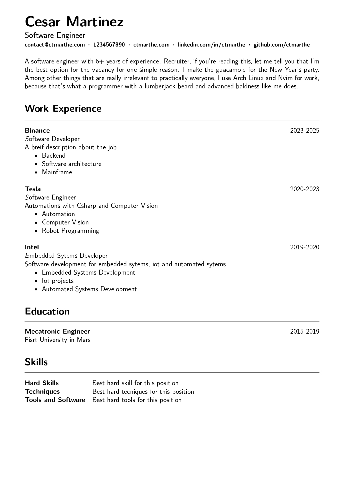

# cvlatex

A basic CV Template in latex for a basic automation process including macros and variables. 
This template can be used for reference and feel free for make it real your own ideas 

## Check the result
---


## Package
---
Setting the documentcalss to article and the encoding type

```latex
\documentclass[12pt]{article}
\usepackage[T1]{fontenc}
```

Defining the dimensions of the document with geometry

```latex
\usepackage[a4paper, left=15mm, right=15mm, top=10mm]{geometry}
```

Changing the default font type to sans font type 

```latex
\renewcommand{\familydefault}{\sfdefault}
```

## Variables
---

Declaring the variables for the document

```latex
\def\name{Cesar Martinez}
\def\job{Software Engineer}
\def\email{contact@ctmarthe.com}
\def\phone{1234567890}
\def\webpage{ctmarthe.com}
\def\linkedin{linkedin.com/in/ctmarthe}
\def\github{github.com/ctmarthe}
```

## Macros
---

Defining the main macros for build the cv sections 
and the main elements for the cv 

```latex
\newcommand{\nametit}[1]{
  \noindent\textbf{\Huge #1}
  \vspace{6pt}
}
\newcommand{\jobtit}[1]{
  \noindent{\large #1}
}
\newcommand{\contact}[2]{
  \noindent
  \textbf{\footnotesize #2}
}
\newcommand{\selfintro}[1]{
  \noindent{#1}
}
\newcommand{\work}[4]{
  \noindent\textbf{#1}
  \hfill #2 \\
  \noindent\textsl #3 \\
  \noindent #4
}
\newcommand{\education}[3]{
  \noindent\textbf{#1}
  \hfill #2 \\
  \noindent #3
}
\newcommand{\skill}[1]{
  #1
}
\newcommand{\sectionsep}{
  \hrule
  \vspace{12pt}
}
```

## The main document
---

The main document for build the cv where we can call the variables
and the macros

```latex

\begin{document}
\newdimen\origiwspc
\newdimen\origiwstr
\origiwspc=\fontdimen2\font
\origiwstr=\fontdimen3\font
\nametit{\name}
\\
\jobtit{\job} 
\\
\fontdimen2\font=0.5ex
\contact{email}{\email} \boldsymbol{\cdot}
\contact{phone}{\phone} \boldsymbol{\cdot}
\contact{web}{\webpage} \boldsymbol{\cdot}
\contact{linkedin}{\linkedin} \boldsymbol{\cdot}
\contact{github}{\github} 
\fontdimen2\font=\origiwspc
\vspace{15pt}
\hfill\break
\selfintro{A software engineer with 6+ years of experience. 
Recruiter, if you're reading this, let me tell you that 
I'm the best option for the vacancy for one simple reason: 
I make the guacamole for the New Year's party.
Among other things that are really irrelevant to practically everyone,
I use Arch Linux and Nvim for work, 
because that's what a programmer with a lumberjack beard 
and advanced baldness like me does.
}
\section*{Work Experience}
\sectionsep
\work{Binance}{2023-2025}{Software Developer}{A breif description about the job}
\begin{itemize}[noitemsep, nolistsep]
  \item Backend
  \item Software architecture
  \item Mainframe
\end{itemize} 
\hfill\break
\work{Tesla}{2020-2023}{Software Engineer}{Automations with Csharp and Computer Vision}
\begin{itemize}[noitemsep, nolistsep]
  \item Automation
  \item Computer Vision
  \item Robot Programming
\end{itemize}
\hfill\break
\work{Intel}{2019-2020}{Embedded Sytems Developer}{Software development for 
embedded sytems, iot and automated sytems}
\begin{itemize}[noitemsep, nolistsep]
  \item Embedded Systems Development
  \item Iot projects
  \item Automated Systems Development
\end{itemize}
\section*{Education}
\sectionsep
\education{Mecatronic Engineer} {2015-2019}{Fisrt University in Mars}
\section*{Skills}
\sectionsep
\begin{tabular} {@{}l l}
  \textbf{Hard Skills} & \skill{Best hard skill for this position} \\
  \textbf{Techniques} & \skill{Best hard tecniques for this position} \\
  \textbf{Tools and Software} & \skill{Best hard tools for this position} \\
\end{tabular}
\end{document}
```
---
<a href="https://www.buymeacoffee.com/ctmarthe" target="_blank"></a>

